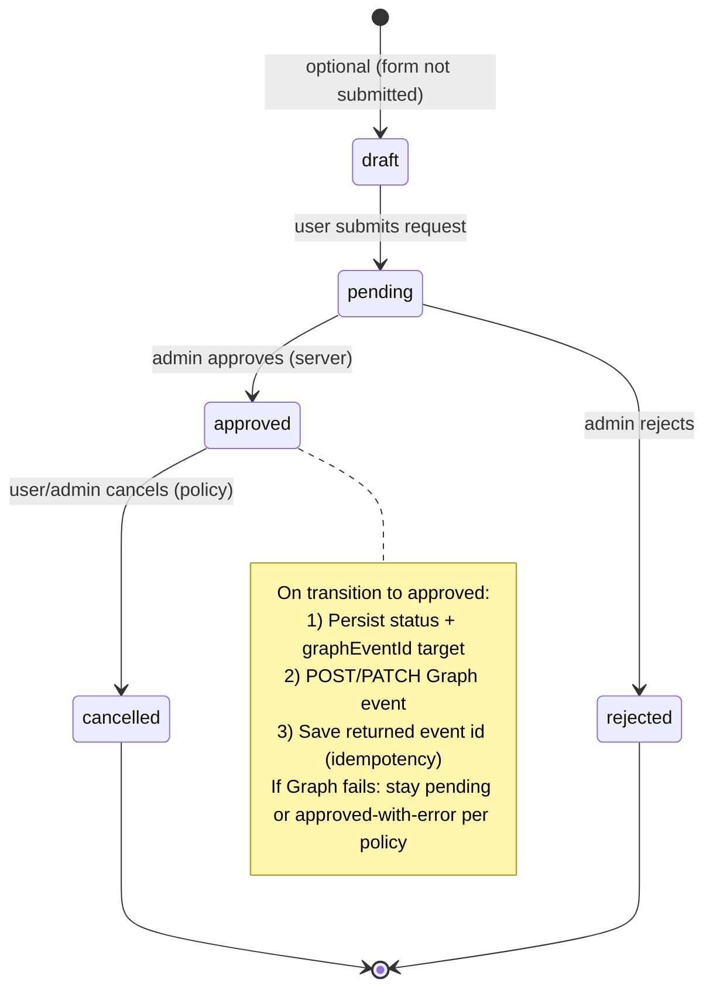
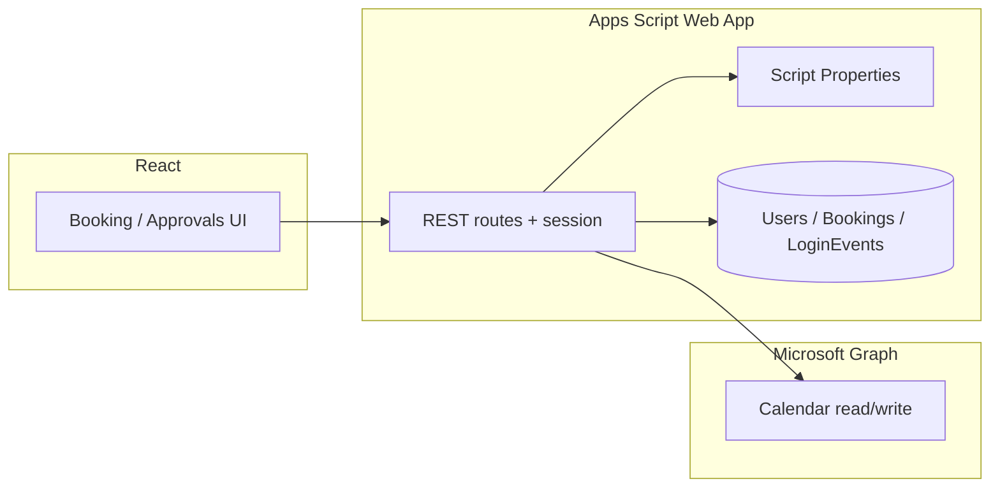

# RoomifyU — Outlook (Microsoft Graph) integration architecture

**Scope:** One-page reference for mailbox choice, where OAuth runs, where tokens live, and how booking records transition before/after Graph writes. Aligns with the React app (`/app`, `/app/admin/approvals`) and a planned Google Apps Script (GAS) backend.

---

## 1. Which Outlook mailbox is the source of truth?

| Option | Use when | Graph pattern |
|--------|----------|-----------------|
| **Shared room / resource mailbox** | Rooms are org-owned; everyone sees the same calendar for availability. **Recommended default for RoomifyU.** | Delegate or app-only access to the room mailbox; read `calendarView` for conflicts; create events in that calendar on approval. |
| **Lecturer / owner mailbox** | Each room “belongs” to a person’s calendar. | Per-room mapping to a user; `Calendars.Read` / `ReadWrite` on those mailboxes (consent complexity scales with users). |
| **Student mailboxes** | Rare for room booking; students don’t own the room resource. | Usually **not** chosen for central room scheduling. |

**Locked decision for implementation:** Treat a **dedicated Microsoft 365 mailbox per bookable room** (or one **shared “rooms” mailbox** with calendar categories/subjects per room) as the **read source** for the booking UI. **Writes on admin approval** create or update the event in **that same calendar** so the UI and Outlook stay aligned. If the org uses **Exchange room mailboxes**, target those addresses explicitly in Graph (`/users/{roomId}/calendar/events` or equivalent resource scheduling APIs as permitted by the tenant).

---

## 2. OAuth host: Google Apps Script vs Node

| Aspect | **GAS Web App (primary)** | **Small Node (or Cloud Function) endpoint** |
|--------|---------------------------|----------------------------------------------|
| Role | Single backend: login, Sheets, Graph proxy, Gemini. OAuth callback URL = deployed Web App URL. | Optional **token exchange only**: authorization code → tokens, refresh rotation; GAS stores refresh tokens via URL fetch to Node once, or Node writes to a store GAS reads (keep one source of truth). |
| When to prefer | Entire backend lives in Apps Script; fewer moving parts. | Microsoft OAuth redirect/state handling in GAS becomes fragile or hits platform limits; you need PKCE or headers GAS doesn’t expose cleanly. |

**Recommendation:** **Start with OAuth completing in GAS** (Web App deployment, redirect URI registered in Azure). **Introduce a minimal Node handler** only if token exchange or refresh fails reliably in GAS after a short spike—keep Sheets + session logic in GAS either way.

---

## 3. Token and secret storage

| Asset | Must never appear in | Store |
|-------|------------------------|--------|
| Microsoft client secret, refresh tokens | React bundle, public repos | **GAS Script Properties** (or server-side secrets store if using Node). |
| Gemini API key | Frontend | Same: Script Properties on GAS; only server routes call Gemini. |
| User session after RoomifyU login | Long-lived password in every request | Short-lived session token or signed cookie **issued by GAS** after password check (see session plan). |

Refresh tokens are **per Microsoft identity used for Graph** (e.g., service account or delegated admin). The UI never receives Graph tokens—only the backend calls Graph with stored refresh + client credentials flow or delegated refresh as designed.

---

## 4. Booking state machine (server-side)

Bookings are persisted in the backend (e.g., Sheets **Bookings** tab) with at least: `id`, `userId`, `roomId`, `start`, `end`, `status`, optional **`graphEventId`**.

**Critical transition:** **`pending` → `approved`**: transactional intent—update row to `approved` only after a successful Graph write **or** define explicitly that `approved` means “authorized” and `graphEventId` empty triggers admin retry UI (pick one model and document it in the API). Recommended: **set `approved` and `graphEventId` in one logical commit**; if Graph fails, return error to admin and **do not** leave orphan “approved” rows without an event id unless you add a `sync_failed` state.

---

## 5. End-to-end data flow (reference)

**Read path:** UI → GAS → Graph `calendarView` (or free/busy) for the chosen room mailbox → UI shows conflicts. **Write path:** Admin approval in UI → GAS updates booking **and** creates/updates Graph event → store **`graphEventId`** on the booking for idempotent updates.

---

*Document version: aligns with RoomifyU routes and admin approval flow; revise mailbox choice if the institution mandates a single room calendar vs per-room mailboxes.*
